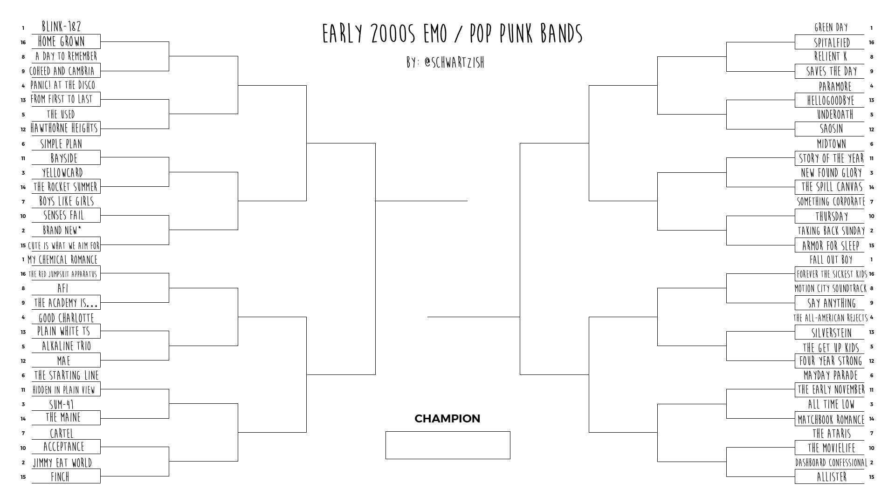

# EARLY 2000S EMO / POP PUNK BANDS

A very scientific and super accurate answer to the battle of the millenium



## How do I run it?

First, you will need [Spotify developer credentials](https://developer.spotify.com/) exported as environment variables:

```bash
export SPOTIFY_CLIENT_ID="whatever"
export SPOTIFY_CLIENT_SECRET="shhh"
```

Everything is written in Scala. If you do not have Scala installed (or a JVM), I recommend following the [One-Click Install](https://www.scala-lang.org/2020/06/29/one-click-install.html) for Scala. It will install everything you need.

All the code is an [Ammonite](https://ammonite.io) script, meaning there is no build process. In the same terminal that you exported your dev keys, run:

```bash
amm battle.sc
```

You should see (something like):

```plaintext
- - - - - - - - - -  blink-182 vs Home Grown. Winner is blink-182.
- - - - - - - - - -  A Day To Remember vs Coheed and Cambria. Winner is A Day To Remember.
- - - - - - - -  blink-182 vs A Day To Remember. Winner is blink-182.
- - - - - - - - - -  Panic! At The Disco vs From First To Last. Winner is Panic! At The Disco.
- - - - - - - - - -  The Used vs Hawthorne Heights. Winner is The Used.
- - - - - - - -  Panic! At The Disco vs The Used. Winner is Panic! At The Disco.
- - - - - -  blink-182 vs Panic! At The Disco. Winner is Panic! At The Disco.
- - - - - - - - - -  Simple Plan vs Bayside. Winner is Simple Plan.
- - - - - - - - - -  Yellowcard vs The Rocket Summer. Winner is Yellowcard.
- - - - - - - -  Simple Plan vs Yellowcard. Winner is Simple Plan.
- - - - - - - - - -  Boys Like Girls vs Senses Fail. Winner is Boys Like Girls.
- - - - - - - - - -  Brand New vs Cute Is What We Aim For. Winner is Brand New.
- - - - - - - -  Boys Like Girls vs Brand New. Winner is Boys Like Girls.
- - - - - -  Simple Plan vs Boys Like Girls. Winner is Simple Plan.
- - - -  Panic! At The Disco vs Simple Plan. Winner is Panic! At The Disco.
- - - - - - - - - -  My Chemical Romance vs The Red Jumpsuit Apparatus. Winner is My Chemical Romance.
- - - - - - - - - -  AFI vs The Academy Is.... Winner is AFI.
- - - - - - - -  My Chemical Romance vs AFI. Winner is My Chemical Romance.
- - - - - - - - - -  Good Charlotte vs Plain White T's. Winner is Good Charlotte.
- - - - - - - - - -  Alkaline Trio vs Mae. Winner is Alkaline Trio.
- - - - - - - -  Good Charlotte vs Alkaline Trio. Winner is Good Charlotte.
- - - - - -  My Chemical Romance vs Good Charlotte. Winner is My Chemical Romance.
- - - - - - - - - -  The Starting Line vs Hidden In Plain View. Winner is The Starting Line.
- - - - - - - - - -  Sum 41 vs The Maine. Winner is Sum 41.
- - - - - - - -  The Starting Line vs Sum 41. Winner is Sum 41.
- - - - - - - - - -  Cartel vs Acceptance. Winner is Cartel.
- - - - - - - - - -  Jimmy Eat World vs Finch. Winner is Jimmy Eat World.
- - - - - - - -  Cartel vs Jimmy Eat World. Winner is Jimmy Eat World.
- - - - - -  Sum 41 vs Jimmy Eat World. Winner is Sum 41.
- - - -  My Chemical Romance vs Sum 41. Winner is My Chemical Romance.
- -  Panic! At The Disco vs My Chemical Romance. Winner is Panic! At The Disco.
- - - - - - - - - -  Green Day vs Spitalfield. Winner is Green Day.
- - - - - - - - - -  Relient K vs Saves The Day. Winner is Relient K.
- - - - - - - -  Green Day vs Relient K. Winner is Green Day.
- - - - - - - - - -  Paramore vs Hellogoodbye. Winner is Paramore.
- - - - - - - - - -  Underoath vs Saosin. Winner is Underoath.
- - - - - - - -  Paramore vs Underoath. Winner is Paramore.
- - - - - -  Green Day vs Paramore. Winner is Green Day.
- - - - - - - - - -  Midtown vs Story Of The Year. Winner is Story Of The Year.
- - - - - - - - - -  New Found Glory vs The Spill Canvas. Winner is New Found Glory.
- - - - - - - -  Story Of The Year vs New Found Glory. Winner is New Found Glory.
- - - - - - - - - -  Something Corporate vs Thursday. Winner is Thursday.
- - - - - - - - - -  Taking Back Sunday vs Armor For Sleep. Winner is Taking Back Sunday.
- - - - - - - -  Thursday vs Taking Back Sunday. Winner is Taking Back Sunday.
- - - - - -  New Found Glory vs Taking Back Sunday. Winner is Taking Back Sunday.
- - - -  Green Day vs Taking Back Sunday. Winner is Green Day.
- - - - - - - - - -  Fall Out Boy vs Forever The Sickest Kids. Winner is Fall Out Boy.
- - - - - - - - - -  Motion City Soundtrack vs Say Anything. Winner is Motion City Soundtrack.
- - - - - - - -  Fall Out Boy vs Motion City Soundtrack. Winner is Fall Out Boy.
- - - - - - - - - -  The All-American Rejects vs Silverstein. Winner is The All-American Rejects.
- - - - - - - - - -  The Get Up Kids vs Four Year Strong. Winner is Four Year Strong.
- - - - - - - -  The All-American Rejects vs Four Year Strong. Winner is The All-American Rejects.
- - - - - -  Fall Out Boy vs The All-American Rejects. Winner is Fall Out Boy.
- - - - - - - - - -  Mayday Parade vs The Early November. Winner is Mayday Parade.
- - - - - - - - - -  All Time Low vs Matchbook Romance. Winner is All Time Low.
- - - - - - - -  Mayday Parade vs All Time Low. Winner is All Time Low.
- - - - - - - - - -  The Ataris vs The Movielife. Winner is The Ataris.
- - - - - - - - - -  Dashboard Confessional vs Allister. Winner is Dashboard Confessional.
- - - - - - - -  The Ataris vs Dashboard Confessional. Winner is Dashboard Confessional.
- - - - - -  All Time Low vs Dashboard Confessional. Winner is All Time Low.
- - - -  Fall Out Boy vs All Time Low. Winner is Fall Out Boy.
- -  Green Day vs Fall Out Boy. Winner is Green Day.
 Panic! At The Disco vs Green Day. Winner is Green Day.

Champion: Green Day!
```

## How does it work?

Data about each band is gathered from the Spotify API and cached locally (already cached in this repo so you shouldn't need to worry about downloading anything). The only relevant numbers I could find in Spotify's data was "populatity" (whatever that means) and "monthly listens". (Ideally, we could get total plays, but they don't expose that data.)

Popularity and monthly listens are multiplied together to produce a band score. The band with the highest score wins.
